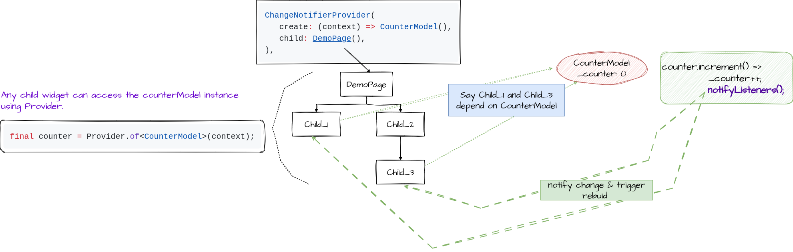

# 5.b) Implement state management using set State and Provider.

## Execution Steps

```
    flutter create lab_5b
    cd lab_5b
            In the generated folder structure replace the content of lib/main.dart with the one given in this folder 
 
    edit the pubspec.yaml to include the provider dependency to the dependencies list.

        dependencies:
                provider: ^6.1.5

    Run the following command to fetch the provider dependency files.

        flutter pub get

    Replace the lib/main.dart with the one in the second/lib/main.dart

        flutter run 

            choose chrome  
```

## Notes - 

Instead of using setState we are using the provider way, setState will be hard to maintain in cases where change need to be propogated to multiple widgets in the hierarchy. 

Provider uses Flutter’s ChangeNotifier to create a class that encapsulates the
state and, when something changes, the interested widgets are notified and rebuilt.
As the name suggests, it’s a notifier that alerts listeners about changes.

Here we need a model object to maintain the required state and ChangeNotifier is a 
mixin which provides notifyListeners method which signals the interested widgets that
something had changed and rebuild is required to reflect the change. 

```dart

        class CounterModel with ChangeNotifier {
                int _counter = 0;

                void increment() {
                        _counter++;
                        notifyListeners();
                }

                void decrement() {
                        _counter--;
                        notifyListeners();
                }

                int get currentCount => _counter;
        }
```

Now setup the ChangeNotifierProvider at a point where it will be available all the child widgets in the hierarchy through Provider. 

```dart

        class MyApp extends StatelessWidget {
                const MyApp({super.key});

                @override
                Widget build(BuildContext context) {
                        return MaterialApp(
                               
                                // Through this we make CounterModel available 
                                // to all the child widgets of DemoPage.                                
                                
                                home: ChangeNotifierProvider(
                                        create: (context) => CounterModel(),
                                        child: DemoPage(),
                                ),

                        );
                }
        }
```

```dart

        class DemoPage extends StatelessWidget {
                
                @override
                Widget build(BuildContext context) {
                        
                        // Fetch counter model object through provider
                        final counter = Provider.of<CounterModel>(context);

                        ......
                        ......
                }
        }
 
```




